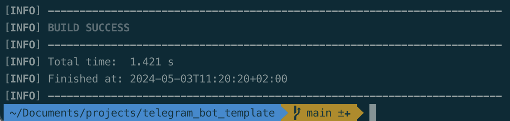
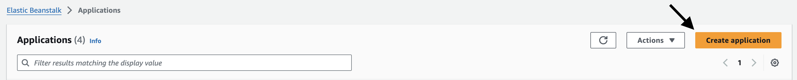
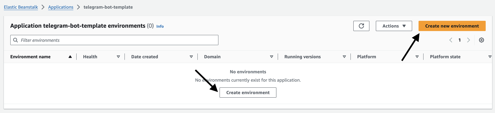
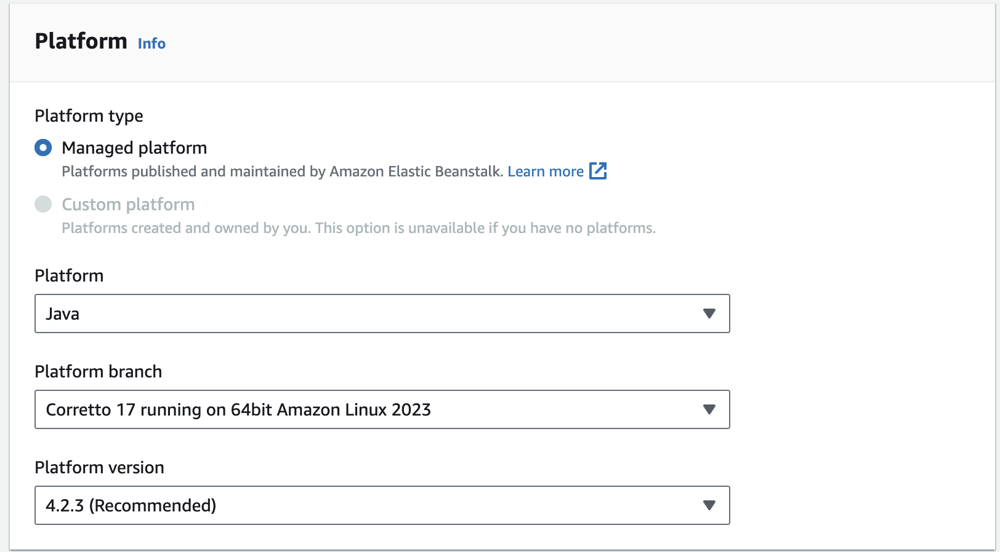
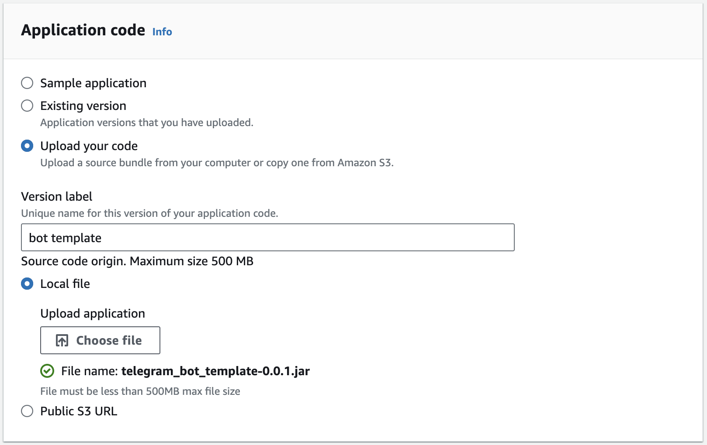
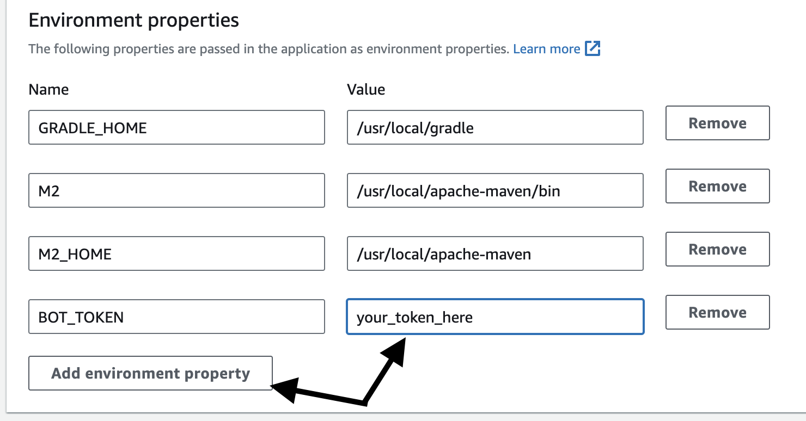
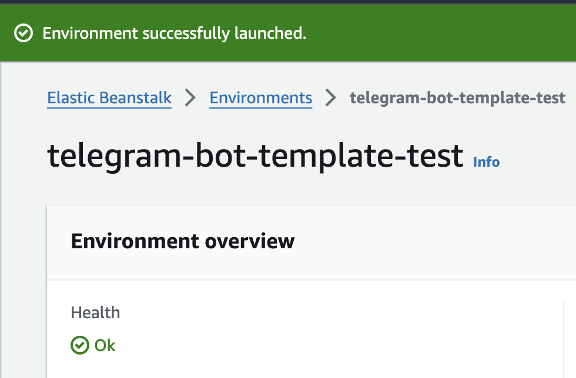
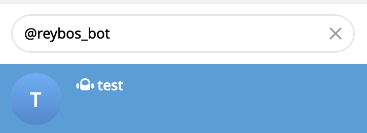
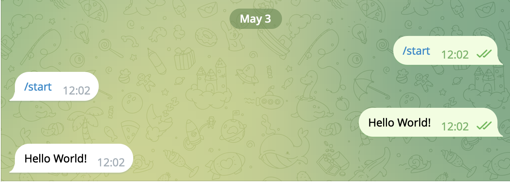

This template is ready to work and deploy to AWS, I had a number of problems with saving application logs, but now it works.

The library is used for the bot to work <a href="https://rubenlagus.github.io/TelegramBotsDocumentation/telegram-bots.html">here</a>

<h3>Register your bot in telegram</h3>

How to do this can be found on the Internet, I found <a  href="https://www.toptal.com/python/telegram-bot-tutorial-python">this link</a>. The token that you receive when creating the bot will later be used when interacting with the telegram api

<h3>Create an AWS account</h3>
During the first year after registration, free resources for testing ideas are available, which I used.

<h3>Assemble the jar archive with the program</h3>
Run the command in the root of the application
>mvn clean install

  

As a result, a file will be created target/telegram_bot_template-0.0.1.jar

Now you can upload it to the server

<h3>Deployment to AWS</h3>

I use Elastic Beanstalk for deployment. Go to this service in your chosen region, I have it <a href="https://us-east-1.console.aws.amazon.com/elasticbeanstalk/home?region=us-east-1#/applications">us-east-1</a>

Let's create a new application. I will name my telegram-bot-template

  

Now let's create a new environment

  

In the environment creation form, I will change only some fields, leave the rest unchanged and will not write about them.

I chose the language and version

  

Select the jar archive to download

  

And finally, in the fifth step, you need to set the environment variable with the bot token.

  

Now everything is ready, you can deploy the bot. It will take a few minutes, once everything is ready you will see a green bar

  

Now you can check the work of the bot

<h3>Checking the bot</h3>

We find a bot and start a correspondence with it

  

Now he can only forward your messages back, but this is just a template, teaching him to do something else is a completely different story.

  

