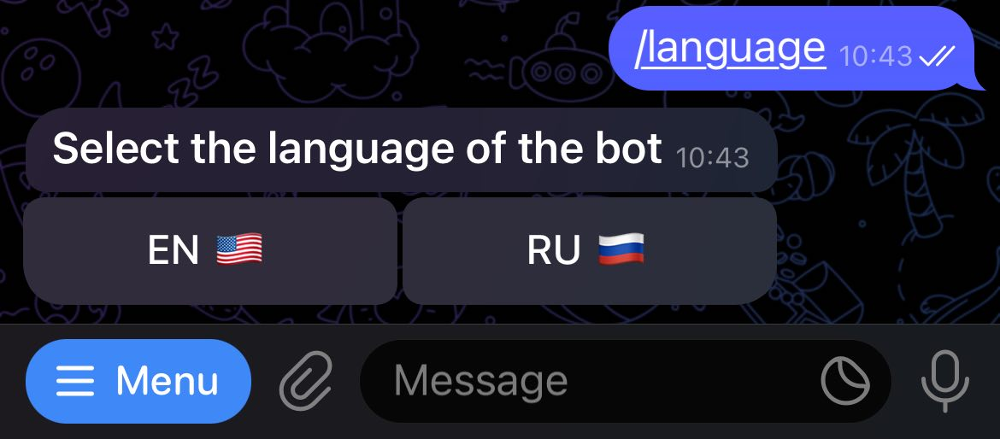
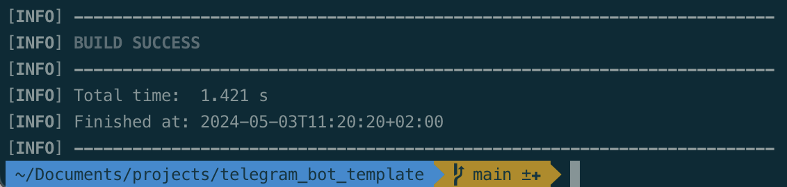
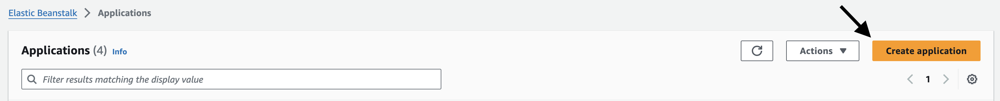
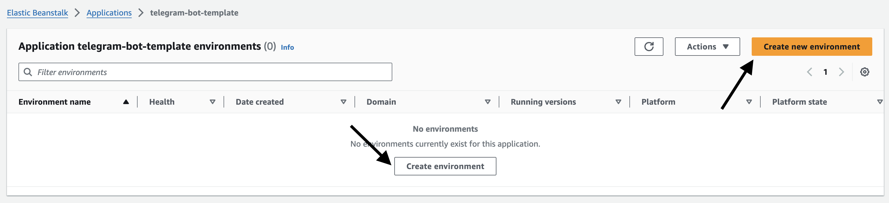
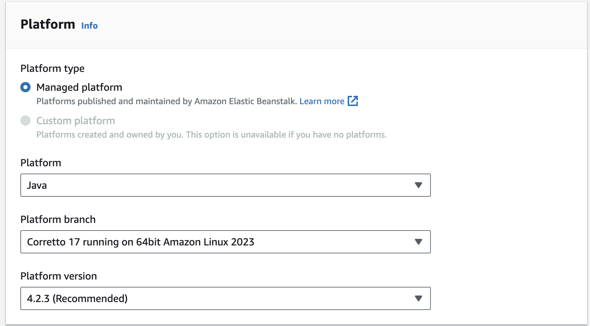
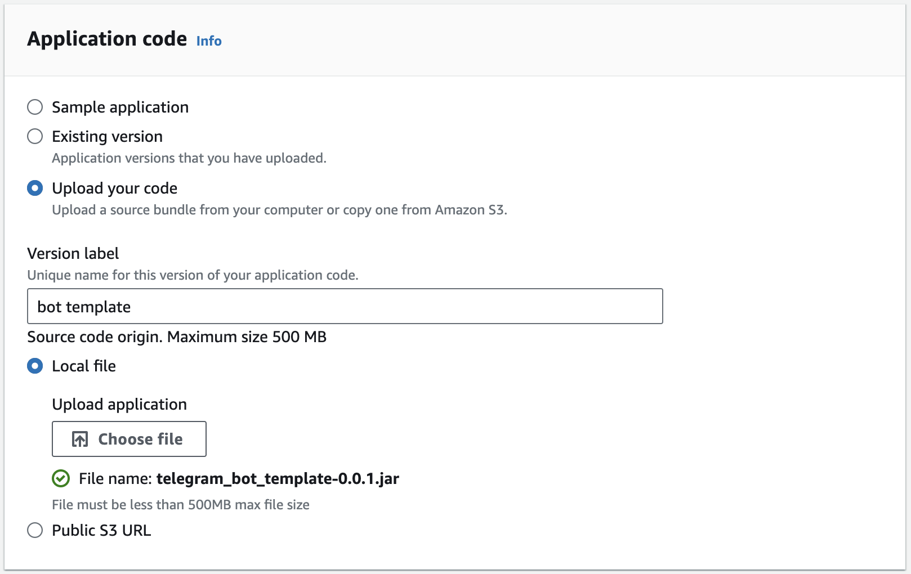
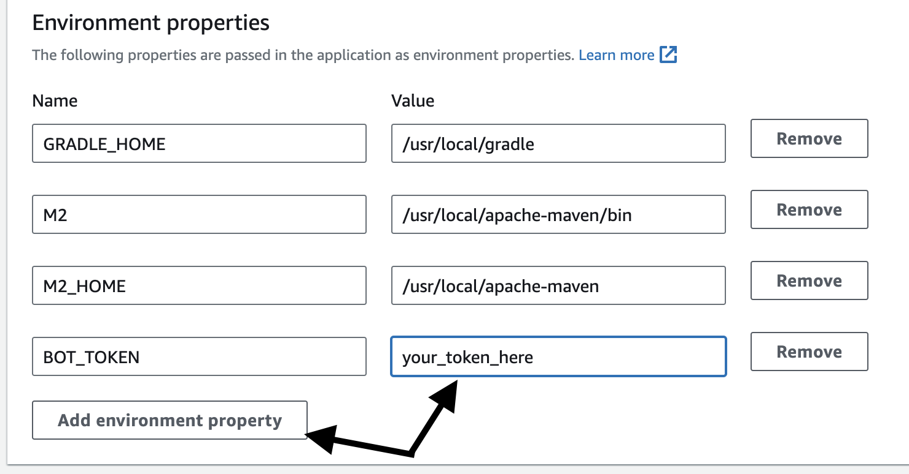
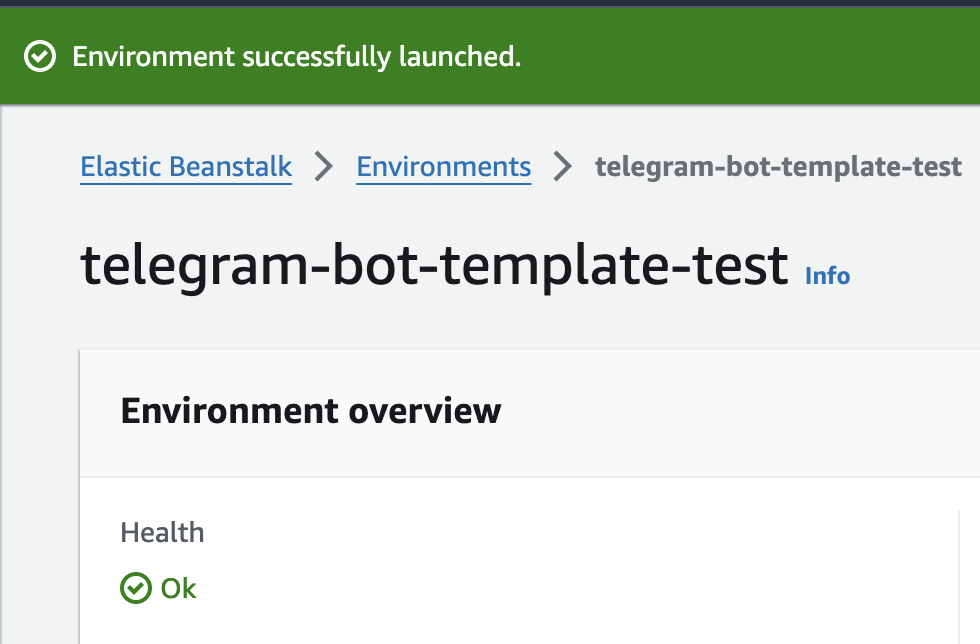

# Telegram bot template

<ul>
    <li>
        <a>About the framework</a>
        <ul>
            <li><a href="#technologies">Technologies</a></li>
            <li><a href="#demonstration">Demonstration of the possibilities</a></li>
            <li><a href="#framework_features">Framework features</a></li>
        </ul>
    </li>
    <li>
        <a>How to use</a>
        <ul>
            <li>
                <a href="#own_functionality">How to add your own functionality</a>
                <ul>
                    <li><a href="#add_language">Add support for a new language</a></li>
                    <li><a href="#add_command">Add support for a new command</a></li>
                    <li><a href="#add_callback">Add support for a new callback</a></li>
                </ul>
            </li>
            <li><a href="#register_bot">Register your bot</a></li>
            <li><a href="#local_launch">Local launch of the application</a></li>
            <li><a href="#deploy_bot">Deploying a bot to AWS</a></li>
        </ul>
    </li>
</ul>

<h2><a name="technologies">Technologies</a>&nbsp;&nbsp;<a href="#menu">&#9650;</a></h3>

<ul>
    <li>Java 17</li>
    <li>Spring Boot</li>
    <li>Maven</li>
    <li><a href="https://github.com/rubenlagus/TelegramBots">Telegram bot library</a></li>
</ul>

<h2><a name="demonstration">Demonstration of the possibilities</a>&nbsp;&nbsp;<a href="#menu">&#9650;</a></h2>

  

<h2><a name="framework_features">Framework features</a>&nbsp;&nbsp;<a href="#menu">&#9650;</a></h2>

- Allows you to create a multilingual bot
- Easy addition of new commands and their processing
- Easy addition of inline buttons and callback processing
- Send/delete/edit messages from the bot

<h2><a name="own_functionality">How to add your own functionality</a>&nbsp;&nbsp;<a href="#menu">&#9650;</a></h2>

<h3><a name="add_language">Add support for a new language</a>&nbsp;&nbsp;<a href="#menu">&#9650;</a></h2>

- Adding a new language to enum `rey.bos.telegram_bot_template.shared.dto.LanguageCode`, LanguageCode.value - language codes that can be found <a href="https://core.telegram.org/bots/features#language-support">here</a>
- Adding a new language to the mapping `rey.bos.telegram_bot_template.shared.mapper.UserDtoMapper`, method `LanguageCode map(String code)`
- In the `rey.bos.telegram_bot_template.dictionary.impl` package, we add a new implementation of the interface `rey.bos.telegram_bot_template.dictionary.Dictionary`, in which you will need to enable support for the new language in the `Dictionary.isSuitable` method and translate all the keys `rey.bos.telegram_bot_template.dictionary.DictionaryKey` in the `Dictionary.get` method

<h3><a name="add_command">Add support for a new command</a>&nbsp;&nbsp;<a href="#menu">&#9650;</a></h2>

- Add a new value to the enum `rey.bos.telegram_bot_template.bot.handler.impl.command.MenuCommand`, if you want the command to be shown in the menu, then add it to the `MenuCommand.getCommandsForMenu` method
- Add a `BotHandler` implementation to the `rey.bos.telegram_bot_template.bot.handler.impl.command` package, which will process this command

<h3><a name="add_callback">Add support for a new callback</a>&nbsp;&nbsp;<a href="#menu">&#9650;</a></h2>

When sending a message to a user, you can add buttons to it, when clicked you can perform some action. For example, changing the language.

  

When you click on any button, a callback event will be sent to the server, with the data that you previously added to it.

- Add a new value for callback to the enum `rey.bos.telegram_bot_template.bot.handler.impl.callback.CallBackCommand`, which can be added to the button and made a handler for the click event
- When sending a message to a user, you can add buttons to it and data with the created callback, using the `MessageUtil.buildSendMessageWithButtons` method
- In the package `rey.bos.telegram_bot_template.bot.handler.impl.callback` we add an implementation of the `BotHandler` interface to handle the added callback event

<h2><a name="register_bot">Register your bot in telegram</a>&nbsp;&nbsp;<a href="#menu">&#9650;</a></h2>

How to do this can be found on the Internet. Here is <a href="https://core.telegram.org/bots#how-do-i-create-a-bot">a link</a> to the telegram documentation. The token that you receive when creating the bot will later be used when interacting with the telegram api

<h2><a name="local_launch">Local launch of the application</a>&nbsp;&nbsp;<a href="#menu">&#9650;</a></h2>

Your bot can be launched locally for debugging, without deployment to the server.

- Download the project to your local computer `git clone git@github.com:reybos/telegram-bot-template.git`
- Go to the folder with the project `cd telegram-bot-template`
- In the project properties you need to specify the token of your bot received when registering in telegram. telegram.token in `src/main/resources/application.properties`
- Run the commands `mvn clean install` and `mvn spring-boot:run`

<h2><a name="deploy_bot">Deploying a bot to AWS</a>&nbsp;&nbsp;<a href="#menu">&#9650;</a></h2>

This template is ready to work and deploy to AWS, I had a number of problems with saving application logs, but now it works.

<h3>Create an AWS account</h3>
During the first year after registration, free resources for testing ideas are available, which I used.

<h3>Assemble the jar archive with the program</h3>
Run the command in the root of the application
>mvn clean install

  

As a result, a file will be created target/telegram_bot_template-0.0.1.jar

Now you can upload it to the server

<h3>Deployment to AWS</h3>

I use Elastic Beanstalk for deployment. Go to this service in your chosen region, I have it <a href="https://us-east-1.console.aws.amazon.com/elasticbeanstalk/home?region=us-east-1#/applications">us-east-1</a>

Let's create a new application. I will name my telegram-bot-template

  

Now let's create a new environment

  

In the environment creation form, I will change only some fields, leave the rest unchanged and will not write about them.

I chose the language and version

  

Select the jar archive to download

  

And finally, in the fifth step, you need to set the environment variable with the bot token.

  

Now everything is ready, you can deploy the bot. It will take a few minutes, once everything is ready you will see a green bar

  

Now you can check the work of the bot. Find your bot in telegram and click the "start" button or send him any message

